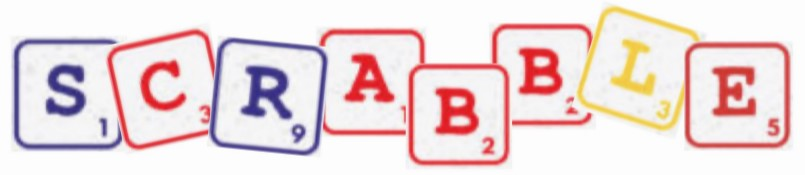
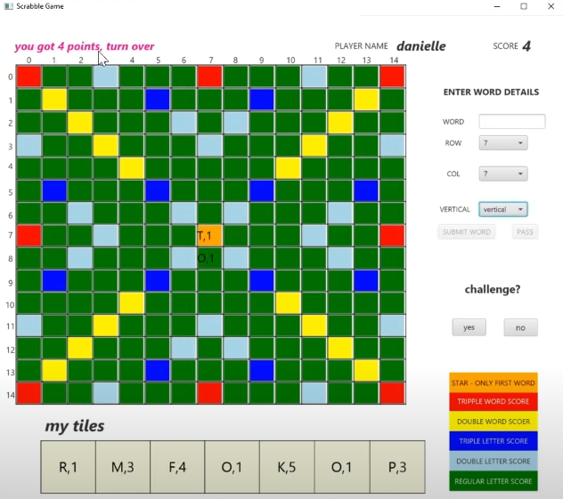

# Overview

Scrabble is a board game inspired by crosswords. In this game, one to four players create words on a 15x15 game board using tiles that have letters printed on them. The goal is to accumulate points, where the number of points the player wins in each move depends on the fixed score for each letter, the color ofthe squares in which the letters were placed, and the words that were created on the board by placing these tiles.

## Project Description
Our project is based on MVVM architecture and a remote Game Server who is responsible for validating the words requested by the players.

MODEL-
We support two different game modes: a local game where several players play on the same computer, and a remote game where several players play from their own computers. As a result, there are two types of model: host and guest.
The host model represents the state of the game. It contains the board, the tiles, the players, and the score. This Model also works as a server of the guest client.
The host's server transferrs all player requests to the Game Server and receives the answers from it using the a protocol we implemented.
In addition, the Model updates its observer, the ViewModel, when changes regarding to the game state occur.

VIEWMODEL-
The ViewModel acts as an intermediary between the View and the Model and as an observer to the Model  .
The ViewModel exposes data and commands that the View binds to, and it interacts with the Model to retrieve and manipulate data. It also handles user interactions and events from the View, updating the Model and notifying the View of any changes.

VIEW-
The View is responsible for displaying the user interface (UI) to the user.
It is bounded by using property data members to the ViewModel layer in order to present on screen the most updated data, such as the board, score, user name and more.

## Game Rules
1. **Starting the Game**: The first player must create a word and place it on the center square.
2. **Word Placement**: Like a crossword puzzle, each new word must connect with at least one of the tiles already on the board.
3. **Legal Words**: A word is considered legal if it meets all the following conditions:
   - It is written from left to right or from top to bottom (and not in any other way).
   - It appears in one of the books chosen for the game.
   - It leans on one of the existing tiles on the board.
   - It does not create any illegal words on the board.
4. **Forfeiting a Turn**: A player who cannot form a legal word forfeits their turn.
5. **Scoring**:
   - Each player's score accumulates based on all the words created on the board following the placement of their tiles.
6. **Special Tile Scoring**:
   - **Central Square**: Doubles the value of the word placed on it. *This bonus applies only for the first player.*
   - **Light Blue Squares**: Double the value of the letter placed on them.
   - **Blue Squares**: Triple the value of the letter placed on them.
   - **Yellow Squares**: Double the value of the entire word placed on them.
   - **Red Squares**: Triple the value of the entire word placed on them.

## Installation
This project is a command-line Scrabble game implemented in Java.

In order to play the game you will need to pull the project files.

## Usage
1. To start the Scrabble game, navigate to the MainApplication class.

2. Start a run.

3. Enter your choice of game mode and player type.

4. Follow the on-screen instructions to play the game.

5. Use the available commands to place tiles, challenge the server, pass your turn, and more.
   
## javadoc
https://rodanielle.github.io/Rodanielle.github.io-scrabble_javadoc/

## Demo
intruduction and information:

https://youtu.be/j9tl4_rWa3o

simple game demo:

https://youtu.be/PAj1GynoXMw

Screenshot:

## Roadmap
[Gantt (1).pdf](https://github.com/RoDanielle/Scrabble/files/11870154/Gantt.1.pdf)

## License
This project is licensed under the MIT License. You are free to use, modify, and distribute this project, as long as the original license and attribution are retained. For more details, see the [LICENSE](LICENSE) file.

## Contributing
Feel free to contribute by opening issues or creating pull requests.

## Authors
For any questions or suggestions, please do not hesitate to contact the project management team:

Danielle Rotem - https://github.com/RoDanielle

Shiraz Sorijoun - https://github.com/ShirazSorijoun

Shahar Loantz - https://github.com/shaharloantz

  
